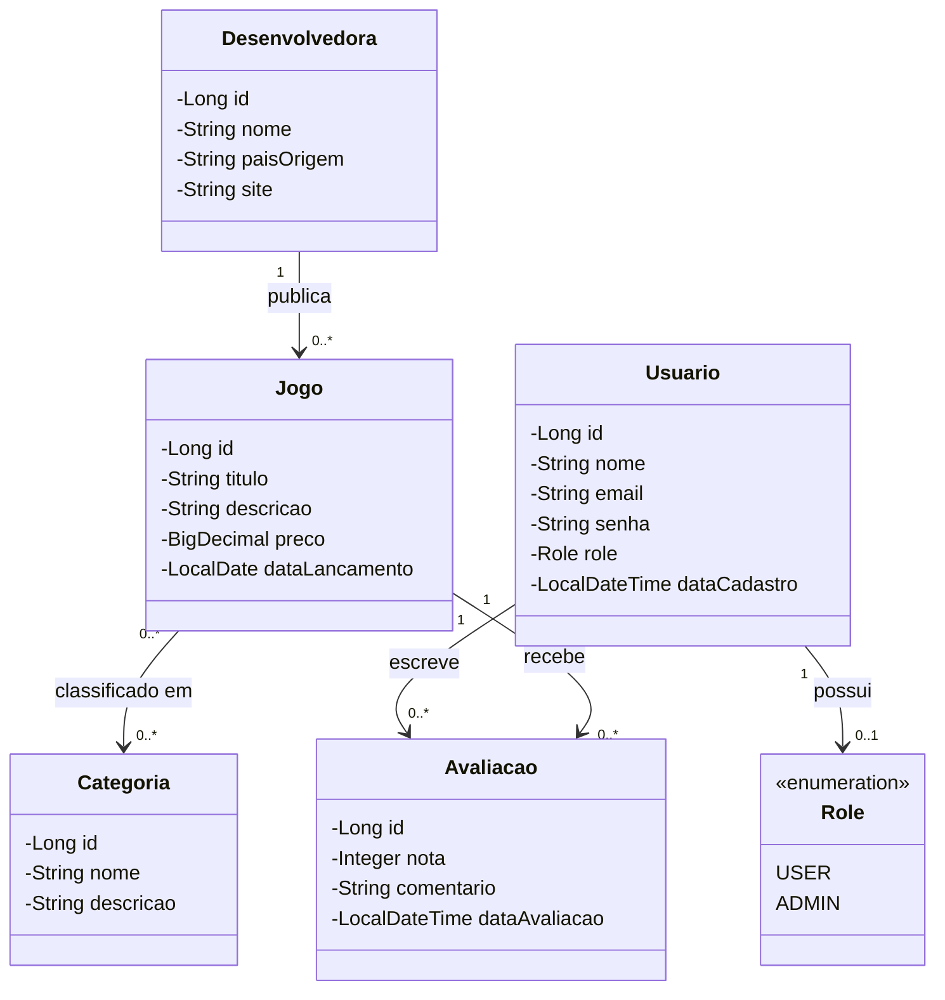
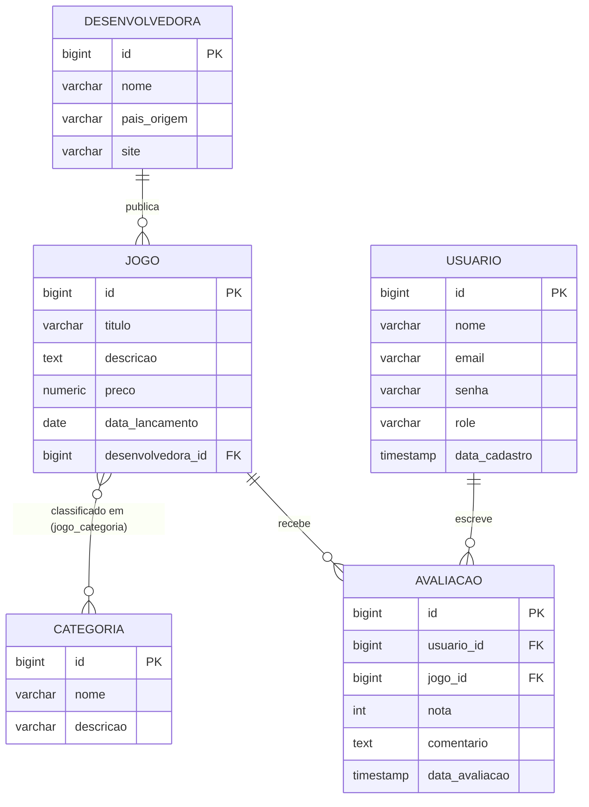

# VAPOR — Documento de Análise (Etapa 1: Planejamento e Modelagem)

> **Trabalho:** Desenvolvimento Backend com Spring Boot
> **Etapa:** 1 — Documento + DER (Planejamento e Modelagem) — Aula 8
> **Sistema:** VAPOR

## 1. Visão Geral do Sistema

**Nome do sistema:** VAPOR

**Inspiração:** [Steam](https://store.steampowered.com/), a plataforma de distribuição digital de jogos da Valve.

**Propósito:** VAPOR é uma plataforma de distribuição digital de jogos onde:

- Jogadores podem se cadastrar, explorar um catálogo de jogos organizados por **categorias** (gêneros) e **desenvolvedoras**, e avaliar os jogos que jogaram.
- Desenvolvedoras/publicadoras cadastram seus jogos na plataforma, associando-os a uma ou mais categorias.
- Cada jogo acumula avaliações (nota + comentário) dos usuários, permitindo calcular uma nota média pública.

O sistema é construído como uma API REST em Spring Boot, seguindo arquitetura em camadas, com persistência em PostgreSQL versionada via Flyway, e autenticação/autorização via JWT (implementada na Etapa 3, conforme cronograma do trabalho).

## 2. Equipe e Responsabilidades

| Integrante | Entidade principal | Responsabilidades |
|---|---|---|
| Bernardo Búrigo | `Usuario` | CRUD de usuários, cadastro/perfil, regras de autenticação (integração com JWT na Etapa 3) |
| Bruno Baldessar | `Jogo` | CRUD de jogos, vínculo com `Desenvolvedora` e `Categoria`, cálculo da nota média a partir das avaliações |
| Bruno Souza | `Desenvolvedora` | CRUD de desenvolvedoras/publicadoras |
| Gabriel Waltrick | `Categoria` | CRUD de categorias/gêneros, relacionamento N:N com `Jogo` (tabela `jogo_categoria`) |
| João Vitor Borges | `Avaliacao` | CRUD de avaliações, regra de unicidade usuário↔jogo, validação de nota (1 a 5) |

> Divisão inicial proposta pela equipe; pode ser reajustada antes da entrega final sem impacto na modelagem.

## 3. Requisitos Funcionais (RF)

| Código | Descrição |
|---|---|
| RF01 | O sistema deve permitir o cadastro e login de usuários, com autenticação via JWT. |
| RF02 | O sistema deve permitir CRUD completo de `Usuario`. |
| RF03 | O sistema deve permitir CRUD completo de `Desenvolvedora`. |
| RF04 | O sistema deve permitir CRUD completo de `Categoria`. |
| RF05 | O sistema deve permitir CRUD completo de `Jogo`, associado a uma `Desenvolvedora` e a uma ou mais `Categoria`. |
| RF06 | O sistema deve permitir CRUD completo de `Avaliacao`, vinculando um `Usuario` a um `Jogo`. |
| RF07 | Um usuário só pode avaliar o mesmo jogo uma única vez (restrição de unicidade `usuario_id` + `jogo_id`). |
| RF08 | O sistema deve permitir listar jogos filtrando por categoria e/ou desenvolvedora. |
| RF09 | O sistema deve calcular e exibir a nota média de um jogo com base em suas avaliações. |
| RF10 | Todas as entradas da API devem ser validadas (`@NotBlank`, `@Email`, `@Size`, `@Min`/`@Max`, etc.), com erros tratados de forma centralizada (`@ControllerAdvice`). |

## 4. Requisitos Não-Funcionais (RNF)

| Código | Descrição |
|---|---|
| RNF01 | A API deve seguir arquitetura em camadas: Controller, Service, Repository, Entity, DTO, Validation, ExceptionHandler. |
| RNF02 | Nenhuma entidade JPA deve ser exposta diretamente pela API — toda entrada/saída passa por DTOs. |
| RNF03 | Persistência em PostgreSQL (versão 12 a 17), com versionamento de schema via Flyway. |
| RNF04 | Autenticação stateless via JWT (Spring Security), sem sessão em servidor. |
| RNF05 | Senhas de usuário devem ser armazenadas com hash (BCrypt), nunca em texto plano. |
| RNF06 | A API deve ser documentada via Swagger/OpenAPI. |
| RNF07 | O código-fonte deve ser versionado em Git/GitHub, com contribuição de todos os membros da equipe. |
| RNF08 | O sistema deve seguir convenções de nomenclatura consistentes (português, `snake_case` no banco / `camelCase` no Java). |

## 5. Modelagem de Entidades — Resumo

| Entidade | Descrição | Relacionamentos |
|---|---|---|
| `Usuario` | Conta de um jogador na plataforma | 1:N com `Avaliacao` |
| `Desenvolvedora` | Estúdio/publicadora responsável por um ou mais jogos | 1:N com `Jogo` |
| `Categoria` | Gênero/etiqueta de classificação de jogos (ex.: RPG, Ação, Indie) | N:N com `Jogo` |
| `Jogo` | Título disponível na loja | N:1 com `Desenvolvedora`; N:N com `Categoria`; 1:N com `Avaliacao` |
| `Avaliacao` | Nota + comentário de um usuário sobre um jogo | N:1 com `Usuario`; N:1 com `Jogo` |

`Avaliacao` funciona como uma **entidade associativa**: resolve o relacionamento N:N entre `Usuario` e `Jogo`, mas carrega atributos próprios (nota, comentário, data), por isso é modelada como entidade de primeira classe e não como tabela puramente associativa.

## 6. Diagrama de Classes (UML)

## 7. Modelo Relacional (DER)

> A tabela `jogo_categoria` (chave composta `jogo_id` + `categoria_id`) implementa fisicamente o relacionamento N:N entre `Jogo` e `Categoria` e não é mostrada como entidade própria no ER acima porque a notação `}o--o{` do Mermaid já representa a cardinalidade N:N diretamente — ela é detalhada no dicionário de dados abaixo.

## 8. Dicionário de Dados

### `usuario`

| Coluna | Tipo | Constraint |
|---|---|---|
| id | BIGSERIAL | PK |
| nome | VARCHAR(150) | NOT NULL |
| email | VARCHAR(150) | NOT NULL, UNIQUE |
| senha | VARCHAR(255) | NOT NULL (hash BCrypt) |
| role | VARCHAR(20) | NOT NULL, DEFAULT `'USER'` |
| data_cadastro | TIMESTAMP | NOT NULL, DEFAULT `now()` |

### `desenvolvedora`

| Coluna | Tipo | Constraint |
|---|---|---|
| id | BIGSERIAL | PK |
| nome | VARCHAR(150) | NOT NULL |
| pais_origem | VARCHAR(100) | — |
| site | VARCHAR(255) | — |

### `categoria`

| Coluna | Tipo | Constraint |
|---|---|---|
| id | BIGSERIAL | PK |
| nome | VARCHAR(80) | NOT NULL, UNIQUE |
| descricao | VARCHAR(255) | — |

### `jogo`

| Coluna | Tipo | Constraint |
|---|---|---|
| id | BIGSERIAL | PK |
| titulo | VARCHAR(150) | NOT NULL |
| descricao | TEXT | — |
| preco | NUMERIC(10,2) | NOT NULL |
| data_lancamento | DATE | — |
| desenvolvedora_id | BIGINT | FK → `desenvolvedora.id`, NOT NULL |

### `jogo_categoria` (tabela associativa N:N)

| Coluna | Tipo | Constraint |
|---|---|---|
| jogo_id | BIGINT | FK → `jogo.id`, PK composta |
| categoria_id | BIGINT | FK → `categoria.id`, PK composta |

### `avaliacao`

| Coluna | Tipo | Constraint |
|---|---|---|
| id | BIGSERIAL | PK |
| usuario_id | BIGINT | FK → `usuario.id`, NOT NULL |
| jogo_id | BIGINT | FK → `jogo.id`, NOT NULL |
| nota | INT | NOT NULL, CHECK (nota BETWEEN 1 AND 5) |
| comentario | TEXT | — |
| data_avaliacao | TIMESTAMP | NOT NULL, DEFAULT `now()` |

> Restrição adicional: `UNIQUE (usuario_id, jogo_id)` — garante que um usuário não avalie o mesmo jogo mais de uma vez (RF07).
